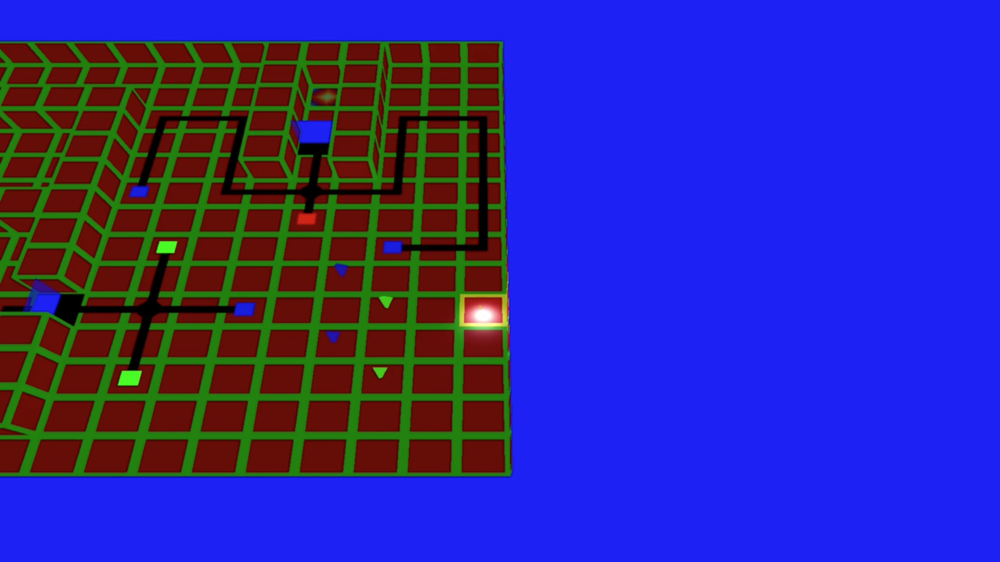

# PI Escape Game
Project for the course System Programming (C003776) | 1st sem 2017 - 2018. Made during my second year of Bachelor of Science in Computer Science at Ghent University.

Made by:
- Arne Goeteyn
- Amory Hoste
- Tom Lauwaerts
- Jorg Wieme

**Controls:** [Controls](controls.md)

## Screenshots

